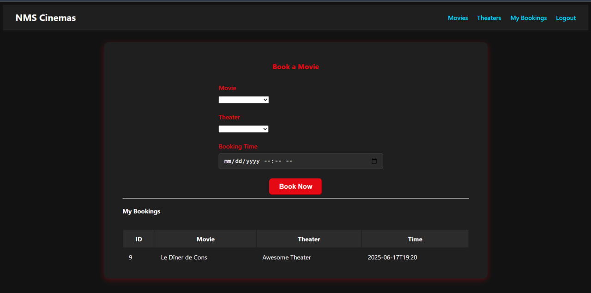

# 🎬 NMS Cinemas (Full-Stack Movie Ticket Booking App)

A modern, full-stack **movie ticket booking** web application for **NMS Cinemas**, built with **Angular** (frontend) and **Spring Boot** (backend).  
Users can browse movies by **genre** and **language**, view available **theaters**, and book tickets online.  
Admins can manage bookings and view all reservations.  
The app is fully **Dockerized** and deployed on **AWS** with a CI/CD pipeline powered by **Jenkins**.

---

## 🚀 Tech Stack

- **Front-End**: Angular, TypeScript, HTML, CSS
- **Back-End**: Java, Spring Boot
- **Database**: MySQL
- **Containerization**: Docker
- **CI/CD**: Jenkins
- **Cloud Deployment**: AWS
- **Version Control**: Git, GitHub

---

## ✨ Features

### 🎟 For Customers
- User authentication (**sign-up/login**)
- Browse movies by **genre** and **language**
- View available **theaters**
- Book tickets online
- View booking history

### 🛠 For Admins
- View all bookings
- Manage movie listings and theaters

---

## 📦 Installation

### 1️⃣ Clone the repository
```bash
   git clone https://github.com/farruxTemurov/nms-cinema-booking-app.git
```
##  Backend Setup (Spring Boot)
```
cd backend
mvn clean install
mvn spring-boot:run
```
##  Frontend Setup (Angular)
```
cd frontend
npm install
ng serve
```
## Screenshots
**Here are some screenshots of the application:**

  
*Caption: The homepage of the application.*

---

  
*Caption: The detailed view of the selected movie.*

---

  
*Caption:  Book a movie with a time and place that suits you.*

---

  
*Caption: Admin view to manage bookings.*


## Contributing
Contributions are welcome! To contribute:

1. Fork this repository
2. Create a new branch (`git checkout -b feature-name`)
3. Commit your changes (`git commit -am 'Add feature'`)
4. Push to the branch (`git push origin feature-name`)
5. Open a Pull Request


if you have any questions ask me.

